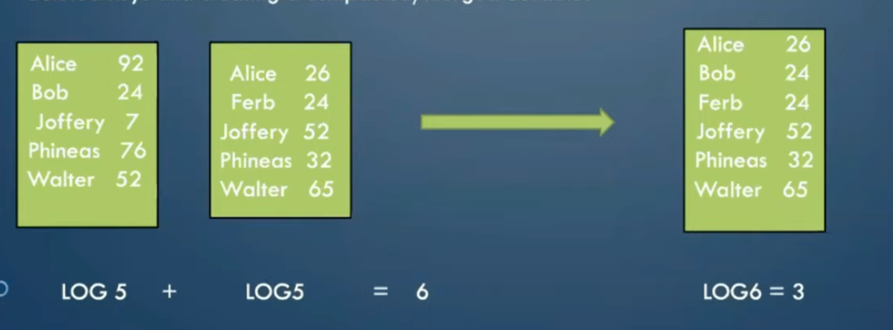

# LSM Practice

Notes and practice material on Log-Structured Merge (LSM) trees and related data structures.

## Table of Contents

- [Conceptual Video Notes](#conceptual-video-notes)

  - [1. LSM Trees](#1-lsm-trees)
    - [1st Concept: Sorted String Tables (SSTables)](#1st-concept-sorted-string-tables-sstables)
    - [2nd Concept: Memtable](#2nd-concept-memtable)
    - [3rd Concept: Compaction](#3rd-concept-compaction)
  - [2. System Design: LSM Trees](#2-system-design-lsm-trees)
  - [3. LSM trees - write and read lifecycles explained](#3-lsm-trees---write-and-read-lifecycles-explained)

## Conceptual Video Notes

### 1. LSM Trees

**Log-Structured Merge Trees**

- Video: [LSM trees (Log Structured Merge Trees) - Detailed video](https://www.youtube.com/watch?v=oUNjDHYFES8)

#### What are LSM Trees, and why should I bother to know them?

> A data structure with performance characteristics that make it very attractive for storing data with high insert and update rates.

**Key characteristics:**

- Comprises tree-like data structures with two levels
  1. memtable, and resides completely in memory
  2. SSTables, stored on disk
- LSM tree is used for systems that are write intensive, and covers most famous DBs like Cassandra/RocksDB, or a messaging system like Pulsar.
- LSM uses 3 concepts to optimize reads and writes

#### 1st concept: Sorted String Tables (SSTables)

**What is an SSTable?**
An SSTable is an immutable, sorted file of key-value pairs stored on disk. Since it can't be modified, updates write a newer value for the same key, while deletes write a tombstone marking the key as deleted. Later, compaction creates new SSTables containing the latest valid data and deletes the old SSTable files.

**What is the simplest and fastest way to write to a database?**

- Appending to the end of a log — O(1) per write.

**What does that cost us when reading?**

- If the log is unsorted, finding a key means scanning every entry — O(N).
- If the log is kept sorted, we can binary search instead — O(log N).

Keeping the log sorted makes reads and lookups much faster than a plain append-only log, at the cost of more work on write.

#### 2nd concept: Memtable

**What is a memtable?**
A temporary, in-memory data structure that stores recent database writes in sorted order. When it reaches a certain size, its data is flushed to disk to create a new SSTable.

**Why should you use a memtable instead of inserting directly into a database?**

- Improved network bandwidth; the number of network calls is reduced.
- Time and resources; the number of I/O calls is reduced. Inserting directly into a database would take **N** I/O calls for **N** writes, while buffering them in a memtable and flushing once takes a single I/O call.
- A downside of a memtable is the added memory usage, but this is a good tradeoff given the network bandwidth and time/resource savings.

**Properties:**

- It is an in-memory structure
- Stores data in sorted fashion
- Acts as a readback cache
- After reaching a certain size, it flushes as an SSTable to the DB

**Write path:**

1. The server writes to the memtable with a key and value, kept sorted by key.
2. When the memtable reaches a size limit, it's flushed as an SSTable to disk, and the memtable is cleared for future writes.
3. If a key is written again with a new value in a later memtable, the old SSTable is not changed (since it's immutable) — instead, both SSTables are kept on disk, each timestamped so the latest value can be identified.

**Read path:**
When reading, we first check whether the key exists in the memtable. If it does, we return it straight from the memtable. If not, we check the SSTables on disk, reading across them to find the latest value, and return that.

#### 3rd concept: Compaction

Worst-case read time from disk: O(N) SSTable lookups, where N is the number of SSTables — in the worst case, every SSTable must be checked.

As the number of SSTables increases, the worst-case read time also increases.

Also, as we keep flushing SSTables to disk, the same key may end up present in multiple SSTables.

A compactor, which usually runs in the background, merges SSTables by removing redundant and deleted keys and creating a single compacted/merged SSTable.

This runs on an interval (e.g., every 30 minutes) and compacts all tables into a single, larger table.

**Bloom filters**

- A bloom filter gives a fast, O(1) check for whether a key might be present in a table. It has no false negatives — if it says a key is _not_ present, it definitely isn't — but it can have false positives, saying a key is present when it actually isn't.

When a write request comes in, it's first written to a Write-Ahead Log (WAL) on disk. This lets us recover the write if there's a failure before it makes it into the memtable/SSTable.

It's then written into the memtable, and once the memtable hits its size limit, it's flushed into an SSTable on disk.

When an SSTable is created, a bloom filter for that table is also created.

**Read path (with bloom filters):** First we check whether the key exists in the memtable; if it does, we return it straight from the memtable. If not, we check each SSTable's bloom filter to see whether the key might be present. If the bloom filter says the key is possibly present, we check that SSTable directly; if it turns out not to be there (a false positive), we move on to the next SSTable, repeating this until we find the value or have checked every SSTable.

Finally, a compactor runs in the background (e.g., every 30 minutes), compacting the SSTables into one.

**Advantages:**

- High write throughput
- Attractive for storing data with high update rates
- Minimized storage overhead

**Disadvantages:**

- Slower reads: memtable → bloom filters → SSTables
- Compaction process can interfere with ongoing reads/writes

### 2. System Design: LSM Trees

- Video: [System Design: LSM Trees](https://www.youtube.com/watch?v=P2xtlLymqqI)

### 3. LSM trees - write and read lifecycles explained

- Video: [LSM trees - write and read lifecycles explained](https://www.youtube.com/watch?v=3KXDlS2tTRY)
